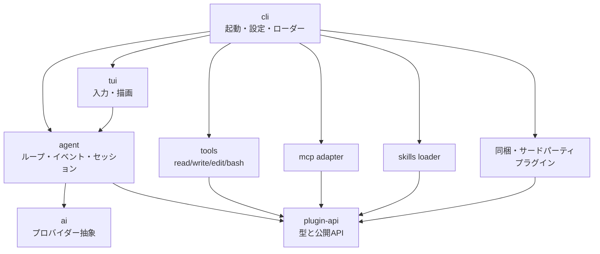

# sasa-code-harness 要件定義書

Sep 24, 2026 · @ささのくさ

## 1. 概要・目的

sasa-code-harness は TypeScript (Bun) で作るターミナル向けコーディングエージェントのハーネスである。コアは「エージェントループ・最小ツール・TUI」に限り、それ以外の振る舞いはすべてプラグインで足す。

**目的**

- 自分の開発フローに合わせて、ハーネスの振る舞いを部品単位で組み替えられるようにする
- 判断をできるだけモデルに委ね、モデルが賢くなった分だけハーネスも賢くなる構造にする
- MCP・Agent Skills (SKILL.md) など既存エコシステムをそのまま再利用する

**想定ユーザー**: 作者本人と、同じ思想を持つ開発者。個人〜小規模チームの利用を前提とし、エンタープライズ管理機能は持たない。

**成功の目安**

- コア（ループ・プロバイダー・組み込みツール）が 4,000 行程度に収まっている（当初 3,000 行。tool-call 修復・生成中フックの追加に合わせて 2026-09-24 に改訂）
- 組み込みツールを含む全機能が、サードパーティと同じ公開プラグインAPIで実装されている
- 日常のコーディング作業をこのハーネスだけで完結できる

## 2. 設計思想

すべての設計判断は下記の原則に照らして行う。迷ったら「コアに入れない」「モデルに任せる」側を選ぶ。

### 2.1 プラグインファースト

| ID | 原則 | 具体的な意味 |
| --- | --- | --- |
| P1 | コアは「無いと動かないもの」だけ | 外してもコードの読み書き・実行ができる機能はプラグインにする |
| P2 | 特権APIを作らない | 組み込みツール・コマンドも公開プラグインAPI経由で登録する（ドッグフーディング） |
| P3 | すべて差し替え可能 | 組み込みツール・同梱プラグインは設定で無効化・同名上書きできる |
| P4 | 既存規格に乗る | ツール拡張は MCP、手順・知識は SKILL.md をそのまま読めるようにする |

### 2.2 エージェントファースト

| ID | 原則 | 具体的な意味 |
| --- | --- | --- |
| A1 | システムプロンプトは短く事実のみ | 環境情報・ツール説明・ユーザー指示だけを渡し、思考手順を指図しない |
| A2 | 思考様式を強制しない | 計画モード・TODO・サブエージェントはコアに持たず、欲しければプラグインで足す |
| A3 | コンテキストはモデルが取りに行く | 事前RAG・自動ファイル注入をコアでしない。探索はツールで行わせる |
| A4 | 結果を加工しすぎない | ツール結果の切り詰めは明示的な上限のみ。切った場合はその事実と続きの取り方をモデルに伝える |
| A5 | 失敗を隠さない | ツールエラー・中断・拒否はすべて tool\_result としてモデルに返し、次の行動を任せる |
| A6 | 介入は安全とユーザー操作に限る | ハーネスがループを止めるのは権限拒否・ユーザー中断・コンテキスト上限だけ |
| A7 | 上限はデフォルトで緩く | 最大ターン数などの人工的な制限はデフォルト無制限、設定でのみ課す |

## 3. スコープ

機能は「コア」「同梱プラグイン」「対象外」の3区分に分ける。同梱プラグインは公式に配布するが、コアとは切り離され、設定で外せる。

| 区分 | 含むもの |
| --- | --- |
| コア | エージェントループ、イベントバス、プロバイダー（Anthropic / OpenAI互換）、組み込みツール（read / write / edit / bash）、TUI、ヘッドレス実行、セッション保存・再開、設定、権限確認の仕組み、プラグインローダー（モジュール / MCP / Skills） |
| 同梱プラグイン | プロジェクト指示の読み込み（AGENTS.md）、コンテキスト圧縮（compaction）、サブエージェント、TODO、Web取得、権限ポリシープリセット |
| 対象外（v1） | IDE拡張、GUI / Web UI、クラウド実行、マルチユーザー管理、OSレベルのサンドボックス、プラグインマーケットプレイス |

検索系ツール（grep / glob）はコアに入れず、bash 経由の ripgrep に任せる（原則 P1・A3）。

## 4. 機能要件（コア）

優先度は Must（v1必須）/ Should（v1で望ましい）/ Could（余裕があれば）。

### 4.1 エージェントループ

| ID | 要件 | 優先度 |
| --- | --- | --- |
| FR-L01 | 入力 → LLM → ツール実行 → 結果返却を、モデルがツールを呼ばなくなるまで繰り返す | Must |
| FR-L02 | テキスト・thinking・ツール呼び出しをストリーミングでイベント発行する | Must |
| FR-L03 | ユーザーが生成・ツール実行を中断でき、中断した事実をモデルに伝える | Must |
| FR-L04 | 同一ターン内の複数ツール呼び出しを並行実行できる（ツール側で並行可否を宣言） | Should |
| FR-L05 | 実行中にユーザーが追加メッセージを送り、次のターンでモデルに届けられる | Should |
| FR-L06 | コンテキスト上限到達時はイベントを発行して停止する（圧縮はプラグインの責務） | Must |
| FR-L07 | APIエラー（429 / 5xx / 過負荷）を指数バックオフで再試行する | Must |

### 4.2 プロバイダー

| ID | 要件 | 優先度 |
| --- | --- | --- |
| FR-P01 | Anthropic Messages API（tool use、extended thinking、prompt caching、画像入力） | Must |
| FR-P02 | OpenAI互換 Chat Completions API（OpenAI、OpenRouter、vLLM、Ollama 等を baseURL で切替） | Must |
| FR-P03 | OpenAI Responses API（reasoning の引き継ぎを含む） | Must |
| FR-P04 | 内部メッセージは正規化形式で持ち、セッション途中でモデル・プロバイダーを切り替えられる | Must |
| FR-P05 | トークン使用量（入力 / 出力 / キャッシュ）と概算コストを記録する | Should |
| FR-P06 | プロバイダー追加も公開プラグインAPI（registerProvider）で行える | Should |

### 4.3 組み込みツール

| ツール | 要件 |
| --- | --- |
| read | 行番号付きで読む。offset / limit 指定、画像ファイルは画像として返す |
| write | 新規作成・全体上書き。親ディレクトリを自動作成 |
| edit | 完全一致の文字列置換。一致が0件・複数件ならエラーを返す。差分を表示用に返す |
| bash | タイムアウト、出力上限（超過分は一時ファイルに逃がしてパスを返す）、中断でプロセスグループごとkill |

### 4.4 TUI と実行モード

| ID | 要件 | 優先度 |
| --- | --- | --- |
| FR-U01 | 複数行入力・入力履歴・貼り付けに対応したエディタ | Must |
| FR-U02 | ストリーミング表示、ツール呼び出しと結果の折りたたみ表示 | Must |
| FR-U03 | スラッシュコマンド（コアは /model /resume /clear /help /permission /fork /session /exit のみ、他はプラグインが追加） | Must |
| FR-U04 | ヘッドレス実行（`sasacode -p "..."`、テキスト / JSONLイベント出力） | Must |
| FR-U05 | プラグインがツール結果の描画・ステータス行・ダイアログを差し込める | Should |
| FR-U06 | SDKとしてライブラリ利用できる（TUIなしでループを埋め込む） | Should |

### 4.5 セッション・設定・権限

| ID | 要件 | 優先度 |
| --- | --- | --- |
| FR-S01 | セッションを JSONL で追記保存し、再開できる。クラッシュ後も最後の完了ターンまで復元できる | Must |
| FR-S02 | 任意の時点から会話を分岐（fork）できる | Should |
| FR-S03 | プラグインがセッションに独自エントリを書き込める（状態の永続化） | Should |
| FR-C01 | 設定はグローバル `~/.sasacode/` とプロジェクト `.sasacode/` の2階層、プロジェクトが優先 | Must |
| FR-C02 | APIキーは環境変数または OS キーチェーンから読む | Must |
| FR-A01 | ツール実行前に allow / ask / deny を判定するフック点と、ユーザー承認UIをコアに持つ | Must |
| FR-A02 | 判定ルール（ツール名・コマンドパターン・パス）は設定とプラグインで与える | Must |
| FR-A03 | 権限モードを4つ持つ（下表）。既定は「読み取り・編集のみ許可」 | Must |
| FR-A04 | `/permission` コマンドと起動フラグで、セッション中にモードを切り替えられる | Must |

| 権限モード | 動作 |
| --- | --- |
| 自動許可 | すべてのツール実行を確認なしで許可する |
| エージェント判断 | モデルが操作の危険度を判定し、安全なものは許可、それ以外はユーザーに確認する |
| ユーザー確認 | 読み取りを含むすべてのツール実行でユーザーに確認する |
| 読み取り・編集のみ許可（既定） | 作業ディレクトリ内の read / write / edit は自動許可し、bash・MCP・その他はユーザーに確認する |

## 5. 機能要件（拡張機構）

プラグインは1つのパッケージに3種類の拡張をまとめて持てる単位とする。インプロセスモジュールが最も強力で、MCP と Skills はその上に載るアダプタ（これ自体も内部プラグイン）として実装する。

### 5.1 プラグインパッケージ

- 配置場所: `~/.sasacode/plugins/`、`.sasacode/plugins/`
- インストール元: npm パッケージと git URL の両方に対応する
- マニフェスト（`plugin.json` または `package.json` の `sasacode` フィールド）に、拡張モジュール・skills ディレクトリ・MCP サーバー定義を宣言する
- TS ファイルをビルドなしで直接ロードする（Bun のネイティブTS実行）
- 型定義パッケージ `@sasacode/plugin-api` を公開し、APIは semver で管理する

### 5.2 インプロセスプラグインAPI

プラグインは `export default (api: PluginAPI) => { ... }` の形で書く。

| API | できること | 優先度 |
| --- | --- | --- |
| registerTool | JSON Schema（または zod）付きのツールを追加・同名で上書き | Must |
| registerCommand | スラッシュコマンドを追加 | Must |
| on(event) | ライフサイクルイベントを購読し、値を変更・ブロック（5.3） | Must |
| registerProvider | LLMプロバイダーを追加 | Should |
| ui.\* | confirm / select / notify、ツール結果レンダラー、ステータス行の追加 | Should |
| session.\* | セッションへの独自エントリ書き込み・読み出し、メッセージの注入 | Should |
| agent.\* | サブループの起動（サブエージェントをプラグインで実装するため） | Should |

### 5.3 フック（イベント）

| イベント | タイミング | ハンドラができること |
| --- | --- | --- |
| session\_start / session\_end | セッション開始・終了 | 初期化、状態復元、後片付け |
| user\_prompt | ユーザー入力の送信前 | 入力の変換・追記、処理して消費（LLMに渡さない） |
| system\_prompt | リクエスト組み立て時 | システムプロンプトへの追記（AGENTS.md、Skills一覧はここで足す） |
| before\_request | LLM呼び出し直前 | メッセージ列の変更（圧縮、キャッシュ制御）、サンプリング設定の変更 |
| stream\_delta | 生成中（テキスト・thinking・ツール引数の差分ごと） | 同期のみ。生成の途中停止（例: 反復の検出） |
| assistant\_message | 応答の確定後、保存前 | 応答の書き換え、再生成、継続指示の注入 |
| tool\_call\_raw | ツールの検索・引数検証の前 | 壊れた JSON・キー名・型・ツール名の修復。修復した内容はモデルに短く伝え、履歴には修復後の呼び出しを残し、元の出力はセッションに別途記録する。max\_tokens で途切れた呼び出しは対象外 |
| tool\_call | ツール実行前 | 引数の変更、allow / ask / deny の判定 |
| tool\_result | ツール実行後 | 結果の変更・追記（例: 編集後のリンタ結果を添える） |
| turn\_end / agent\_end | ターン終了・ループ停止 | 通知、継続指示の注入 |
| context\_limit | コンテキスト上限到達 | 圧縮して再開、または停止 |

ハンドラは登録順に直列実行し、例外は該当プラグインのエラーとして表示してループは継続する。1回の応答での順序は before\_request → stream\_delta → assistant\_message → tool\_call\_raw → 検証 → tool\_call → 権限判定 → 実行 → tool\_result。

### 5.4 MCP

- stdio と Streamable HTTP のトランスポートに対応する（Must）
- MCPツールは `mcp__<server>__<tool>` として通常ツールと同じ権限・フックを通る（Must）
- サーバー定義は設定ファイルとプラグインマニフェストの両方に書ける（Must）
- 遅延ロード: 対象ツールの定義合計がコンテキストウィンドウの **10% 以上**、または対象ツールが **30 個以上**になったら、名前と説明の一覧だけを渡し、モデルが検索ツール経由で定義を読み込む（Must）
  - 対象は MCP ツールとプラグインのツール。組み込み4ツールと `alwaysLoad` 指定のツールは常に先読みし、計算に含めない
  - 閾値は割合と件数の両方を設定で変えられ、常に有効 / 無効も選べる
  - 根拠: Claude Code の auto モードの既定が 10%。また同ドキュメントによると、ツール選択の精度は 30〜50 個を超えると落ちる。200K コンテキストでは 10% = 約 20K トークン（ツール 50〜100 個分）なので、精度のために件数条件を併用する（[出典](https://code.claude.com/docs/en/agent-sdk/tool-search)）
- Anthropic ではネイティブの tool search を使い、それ以外のプロバイダーではハーネス側の検索ツールで代替する（Should）
- prompts をスラッシュコマンドとして公開、resources の参照（Could）

### 5.5 Skills

- 標準の Agent Skills 形式（`SKILL.md`、frontmatter に name / description）のみに対応し、Claude 固有の配置や拡張は扱わない（Must）
- `~/.sasacode/skills/`、`.sasacode/skills/`、プラグインから検出する（Must）
- システムプロンプトには name と description とパスだけを載せ、本文はモデルが read ツールで必要時に読む（段階的開示、原則 A3）（Must）
- ユーザーが `/skill:<name>` で明示的に読み込ませることもできる（Should）

## 6. 非機能要件

数値はすべて初期目標であり、M1 完了時に実測して見直す。

| 分類 | 要件 |
| --- | --- |
| 性能 | 起動から入力可能まで 300 ms 以内（プラグイン0個時）。プラグイン・MCP の初期化は入力をブロックしない |
| 性能 | ストリーミング中のTUI再描画で入力遅延を体感させない（差分描画） |
| シンプルさ | コアの実行時依存パッケージを最小限にし、追加時は理由を記録する |
| 安全性 | 既定は作業ディレクトリ内の読み取り・編集のみ自動許可し、bash 等は承認制。APIキーやシークレットをセッションログ・デバッグログに残さない |
| 安全性 | インプロセスプラグインはフル権限で動くことを明記し、プロジェクトローカルのプラグイン・MCP は初回読み込み時に信頼確認を出す |
| 耐障害性 | プラグインの例外・MCPサーバーの落ちでループ全体を止めない。セッションはイベントごとに追記し、強制終了でも失わない |
| 可搬性 | macOS / Linux を必須、Windows は WSL 経由で動けばよい |
| 配布 | npm パッケージと `bun build --compile` による単一バイナリの2形態 |
| 観測性 | 送受信した全メッセージとツール入出力をセッションに残し、後から再現・検証できる。外部送信（OTel 等）はプラグイン |
| テスト容易性 | プロバイダー応答の録画・再生で、LLMなしにループとプラグインを E2E テストできる |
| 拡張性 | プラグインAPIの破壊的変更はメジャーバージョンでのみ行い、古いプラグインは警告付きで読み飛ばす |

## 7. アーキテクチャ概要

Bun workspaces のモノレポで、依存は上から下への一方向のみ。組み込みツール・MCP・Skills はすべて plugin-api だけに依存し、コア内部には触れない。

パッケージの責務は下表のとおり。

| パッケージ | 責務 |
| --- | --- |
| `@sasacode/ai` | 正規化メッセージ型、Anthropic / OpenAI（Chat Completions・Responses）アダプタ、ストリーム変換、使用量計測 |
| `@sasacode/agent` | ループ、イベントバス、ツール実行と権限判定の呼び出し、ツール遅延ロード、セッションJSONL |
| `@sasacode/plugin-api` | プラグインが依存する唯一の公開型とインターフェース |
| `@sasacode/tools` | 組み込み4ツール（プラグインとして実装） |
| `@sasacode/tui` | pi-tui（第一候補）の上に、エディタ・メッセージ描画・承認ダイアログ・プラグイン用UI差し込み口を載せる |
| `@sasacode/cli` | `sasacode` コマンド。引数解析、設定マージ、プラグイン・MCP・Skills の検出とロード、ヘッドレス実行 |

## 8. 決定事項とマイルストーン

### 8.1 決定事項

| 論点 | 決定 |
| --- | --- |
| OpenAI Responses API | コアで対応する（FR-P03） |
| プロジェクト指示・Skills の互換 | AGENTS.md に対応し、CLAUDE.md は読まない。Skills は Claude 固有形式ではなく標準の Agent Skills 形式（5.5） |
| 権限の既定 | 4モードを用意し、既定は「読み取り・編集のみ許可」。`/permission` で変更（FR-A03・A04） |
| ツールの遅延ロード | 対象ツールの定義がコンテキストの10%以上、または30個以上で遅延ロードする仕組みをコアに持つ（5.4） |
| TUI 実装 | 自作せず、pi-tui を第一候補として流用する（8.2、Bun での動作は要検証） |
| プラグイン配布 | npm と git URL の両方を許可（5.1） |
| CLI コマンド名 | `sasacode`（設定ディレクトリ `.sasacode/`、パッケージスコープ `@sasacode/`） |

### 8.2 TUI の流用元

**pi-tui を推奨する。** 最小主義のコーディングエージェント pi の描画層だけを切り出したライブラリで、思想が近く、依存が2つしかない。コンポーネントが render() だけの単純な形なので、プラグインが UI を差し込む API（FR-U05）も設計しやすい。

| 候補 | 形態 | 採用実績 | 適合度と懸念 |
| --- | --- | --- | --- |
| [pi-tui](https://github.com/earendil-works/pi)（`@earendil-works/pi-tui` 0.84.1、MIT） | TS の命令型コンポーネント。差分描画と同期出力（CSI 2026）で、スクロールバックを壊さない | pi | ◎ 依存は marked と get-east-asian-width のみ（全角幅に対応）。補完付きエディタ、Markdown、オーバーレイ、画像を同梱。engines は Node 22.19 以上で、Bun での動作は検証が必要 |
| [OpenTUI](https://github.com/anomalyco/opentui)（`@opentui/core`、MIT） | Zig のネイティブコア＋TS、React / Solid バインディング | OpenCode | ○ Bun 前提で相性は良い。ただしネイティブバイナリに依存し、Windows ARM64 で起動できない報告がある |
| [Ink](https://github.com/vadimdemedes/ink)（MIT） | React＋Yoga（Flexbox） | Claude Code、Gemini CLI、GitHub Copilot CLI | △ 実績は最多で、`incrementalRendering` オプションもある。ただし React が入ってコアが重くなる。Claude Code はちらつき対策で描画層を書き直した |

進め方: M1 の最初に pi-tui を Bun 上で動かし、日本語入力・貼り付け・ストリーミング描画を検証する。問題があれば OpenTUI に切り替える。出典: [pi-tui 概要](https://badlogic-pi-mono.mintlify.app/tui/overview)、[pi-tui package.json](https://raw.githubusercontent.com/badlogic/pi-mono/main/packages/tui/package.json)、[OpenTUI Windows ARM64 の問題](https://github.com/anomalyco/opencode/issues/38520)、[The Signature Flicker](https://steipete.me/posts/2025/signature-flicker)

### 8.3 マイルストーン

| 段階 | 内容 | 完了条件 |
| --- | --- | --- |
| M0 骨格 | ループ、Anthropic / OpenAI (Chat Completions / Responses) プロバイダー、4ツール、ヘッドレス実行 | `sasacode -p` で小さなバグ修正が完了できる |
| M1 日常利用 | TUI、セッション保存・再開、設定、権限確認 | 作者がこのハーネス自身の開発に使える |
| M2 プラグインAPI | plugin-api、フック、組み込みツールをAPI経由に移行 | コアが特権APIなしで動く |
| M3 エコシステム | MCP、Skills、ツール遅延ロード | 既存のMCPサーバーとSKILL.mdがそのまま動く |
| M4 同梱プラグイン | AGENTS.md、圧縮、サブエージェント、TODO、配布ビルド | 単一バイナリで配布できる |
